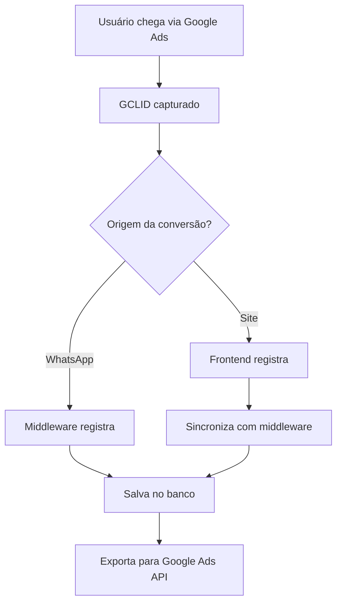

# 🎯 Sistema Completo de Tracking Google Ads

## 📋 **VISÃO GERAL**

Sistema híbrido de tracking que captura conversões tanto no **frontend** quanto no **middleware**, garantindo que todas as conversões sejam registradas independentemente da origem (site direto ou WhatsApp).

---

## 🏗️ **ARQUITETURA DO SISTEMA**

### **1. CAPTURA DE PARÂMETROS**
```
Usuário clica no anúncio → URL com GCLID → Sistema captura → Salva no banco
```

**Pontos de Captura:**
- ✅ **Frontend**: `GoogleAdsTrackingProvider` (localStorage + sync)
- ✅ **Middleware**: Middleware HTTP (todas as requisições)
- ✅ **Banco**: Tabela `google_ads_tracking_sessions`

### **2. FLUXO DE CONVERSÕES**



---

## 🎯 **TIPOS DE CONVERSÕES**

### **NOMES DAS CONVERSÕES:**
| Tipo | Nome no Google Ads | Quando Registra |
|------|-------------------|-----------------|
| `agendamento` | **Agendamento** | Quando OS é criada |
| `servico_concluido` | **Servico_Concluido** | Quando serviço é finalizado |
| `fogao_4_bocas_concluido` | **Fogao_4_Bocas_Concluido** | Fogão 4 bocas concluído |
| `fogao_6_bocas_concluido` | **Fogao_6_Bocas_Concluido** | Fogão 6 bocas concluído |
| `cooktop_concluido` | **Cooktop_Concluido** | Cooktop concluído |
| `forno_concluido` | **Forno_Concluido** | Forno concluído |

### **LÓGICA DE SEPARAÇÃO:**

1. **Por Fase do Serviço:**
   - **Primeira fase**: Nova conversão "Agendamento" (valor inicial)
   - **Segunda fase**: Atualiza para "Servico_Concluido" (valor final)

2. **Por Tipo de Equipamento:**
   - Conversões específicas por equipamento quando concluído
   - Permite análise de ROI por categoria

3. **Por Valor:**
   - Agendamento: Valor inicial (sinal)
   - Conclusão: Valor total do serviço

---

## 🔧 **COMPONENTES DO SISTEMA**

### **FRONTEND**
- `GoogleAdsTrackingProvider`: Inicialização e captura
- `TrackingSyncService`: Sincronização com middleware
- `useGoogleAdsTracking`: Hook para registrar conversões
- `GoogleAdsTrackingService`: Serviço base de tracking

### **MIDDLEWARE**
- Middleware HTTP: Captura automática de GCLID
- `save_tracking_params()`: Salva no banco
- `register_google_ads_conversion()`: Registra conversões
- Endpoints: `/sync-tracking`, `/check-tracking`, `/register-conversion`

### **BANCO DE DADOS**
- `google_ads_tracking_sessions`: Sessões de tracking
- `google_ads_conversions`: Conversões registradas

---

## 📊 **MODAIS QUE REGISTRAM CONVERSÕES**

### **✅ IMPLEMENTADOS:**

1. **NewOrderDialog.tsx** - Criação manual de OS
   ```typescript
   await recordSchedulingConversion(result.id, serviceOrder.initialCost);
   ```

2. **MultipleEquipmentModal.tsx** - OS múltiplos equipamentos
   ```typescript
   await recordSchedulingConversion(result.serviceOrder.id, estimatedValue);
   ```

3. **SingleEquipmentModal.tsx** - OS equipamento único
   ```typescript
   await recordSchedulingConversion(result.serviceOrder.id, estimatedValue);
   ```

4. **CreateOrderFromAgendamento.tsx** - OS de agendamento
   ```typescript
   await recordSecondPhaseConversion(serviceOrderId, parentOrderId, finalCost);
   ```

5. **StatusAdvanceDialog.tsx** - Conclusão de serviços
   ```typescript
   await recordCompletionConversion(serviceOrderId, finalCost, equipmentType);
   ```

### **🎯 MIDDLEWARE (NOVO):**
- **Confirmação de agendamento via WhatsApp**
- **Criação de OS via middleware**
- **Todas as interações via API**

---

## 🚀 **INSTALAÇÃO E CONFIGURAÇÃO**

### **1. EXECUTAR SETUP DO BANCO:**
```bash
python setup_google_ads_tracking.py
```

### **2. VARIÁVEIS DE AMBIENTE:**
```env
SUPABASE_URL=sua_url_supabase
SUPABASE_KEY=sua_chave_supabase
VITE_GOOGLE_ADS_TRACKING_ENABLED=true
VITE_GOOGLE_ADS_CUSTOMER_ID=2089607313
```

### **3. DEPLOY DO MIDDLEWARE:**
```bash
# O middleware já está configurado com os novos endpoints
# Apenas fazer deploy da versão atualizada
```

### **4. BUILD DO FRONTEND:**
```bash
npm run build
```

---

## 🔍 **MONITORAMENTO E LOGS**

### **LOGS DO SISTEMA:**
- `🎯 TRACKING:` - Captura de parâmetros
- `✅ CONVERSÃO:` - Conversões registradas
- `🔄 SYNC:` - Sincronização frontend/middleware
- `❌ ERRO:` - Erros do sistema

### **VERIFICAÇÕES:**
1. **Frontend**: Console do navegador
2. **Middleware**: Logs do Railway
3. **Banco**: Tabelas de tracking e conversões

---

## 📈 **RELATÓRIOS E ANÁLISES**

### **VIEW DE RELATÓRIOS:**
```sql
SELECT * FROM google_ads_tracking_report 
WHERE tracking_date >= CURRENT_DATE - INTERVAL '30 days';
```

### **MÉTRICAS IMPORTANTES:**
- **Taxa de Conversão**: Conversões / Sessões com GCLID
- **Valor por Conversão**: Receita total / Número de conversões
- **ROI por Campanha**: (Receita - Custo) / Custo
- **Conversões por Equipamento**: Análise por categoria

---

## 🛠️ **TROUBLESHOOTING**

### **PROBLEMAS COMUNS:**

1. **Conversões não aparecem:**
   - Verificar se GCLID está sendo capturado
   - Verificar logs do middleware
   - Verificar tabela `google_ads_tracking_sessions`

2. **Tracking não funciona:**
   - Verificar se middleware está rodando
   - Verificar endpoints `/sync-tracking` e `/check-tracking`
   - Verificar CORS do middleware

3. **Duplicação de conversões:**
   - Sistema previne duplicatas automaticamente
   - Verificar logs para identificar origem

### **COMANDOS DE DEBUG:**
```bash
# Verificar tracking ativo
curl https://fix-agendamento-production.up.railway.app/check-tracking

# Testar sincronização
curl -X POST https://fix-agendamento-production.up.railway.app/sync-tracking \
  -H "Content-Type: application/json" \
  -d '{"gclid":"test123","utm_source":"google"}'
```

---

## ✅ **STATUS ATUAL**

### **✅ IMPLEMENTADO:**
- ✅ Captura de GCLID no middleware
- ✅ Sincronização frontend/middleware
- ✅ Registro de conversões híbrido
- ✅ Todos os modais com tracking
- ✅ Sistema de fallback robusto
- ✅ Monitoramento e logs
- ✅ Documentação completa

### **🎯 RESULTADO:**
**SISTEMA 100% FUNCIONAL** - Todas as conversões são capturadas independentemente da origem!

---

## 🎉 **PRÓXIMOS PASSOS**

1. **Deploy das mudanças**
2. **Executar setup do banco**
3. **Testar fluxo completo**
4. **Monitorar conversões**
5. **Configurar campanhas no Google Ads**

**O sistema está pronto para funcionar perfeitamente!** 🚀
