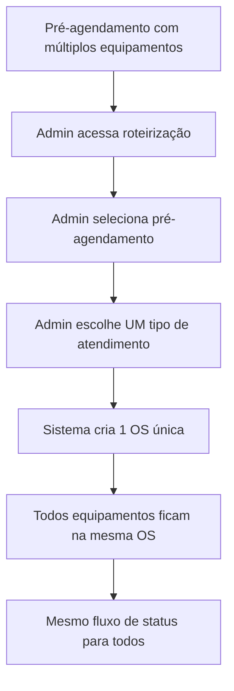
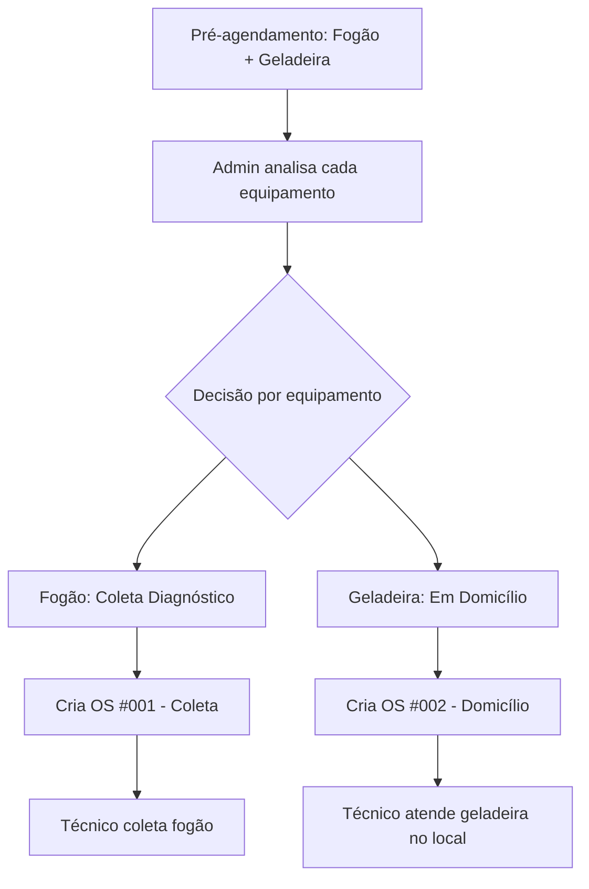

# 📋 ANÁLISE: PRÉ-AGENDAMENTOS COM MÚLTIPLAS SOLICITAÇÕES

**Data:** Janeiro 2025  
**Status:** Análise Completa  
**Prioridade:** Média-Alta  

## 🔍 SITUAÇÃO ATUAL DO SISTEMA

### 1. RECEPÇÃO DE PRÉ-AGENDAMENTOS (ClienteChat → Sistema)

O sistema atual recebe pré-agendamentos através do middleware Python que processa:

```python
# Estrutura atual do middleware
equipamento: str          # Equipamento principal
problema: str            # Problema principal  
equipamento_2: Optional[str]  # Equipamento adicional
problema_2: Optional[str]     # Problema adicional
equipamento_3: Optional[str]  # Equipamento adicional
problema_3: Optional[str]     # Problema adicional
```

**Processamento:**
- Equipamentos são armazenados em arrays JSON: `['Fogão', 'Geladeira']`
- Problemas são armazenados em arrays JSON: `['Não acende', 'Não gela']`
- Salvos na tabela `agendamentos_ai` com status `'pendente'`

### 2. FLUXO ATUAL DE CONVERSÃO



## 🚨 PROBLEMAS IDENTIFICADOS

### 1. LIMITAÇÕES CRÍTICAS

#### **Falta de Diferenciação de Tipos de Atendimento:**
- Sistema não distingue se equipamento precisa de "coleta" vs "domicílio"
- Todos equipamentos tratados com mesmo tipo de atendimento
- Não há campos `tipo_atendimento_2`, `tipo_atendimento_3` no middleware

#### **Conversão Simplificada para OS:**
- Admin cria apenas **1 ordem** por pré-agendamento
- Múltiplos equipamentos agrupados em `serviceItems[]` da mesma OS
- **Todos herdam o mesmo tipo de atendimento** escolhido pelo admin

#### **Fluxo Inadequado para Cenários Mistos:**
**Exemplo problemático:**
- Cliente tem: Fogão (coleta diagnóstico) + Geladeira (domicílio)
- Sistema atual: Cria **1 OS** com ambos no **mesmo tipo de atendimento**

### 2. IMPACTOS NOS ENVOLVIDOS

#### 👨‍💼 **ADMIN:**
- ✅ **Funciona:** Pode criar OS a partir de pré-agendamentos
- ❌ **Limitação:** Forçado a escolher apenas 1 tipo para todos equipamentos
- ❌ **Problema:** Não consegue otimizar logística

#### 🔧 **TÉCNICO:**
- ✅ **Funciona:** Recebe OS com lista de equipamentos
- ❌ **Ineficiência:** Pode precisar fazer 2 viagens desnecessárias
- ❌ **Confusão:** Equipamentos com necessidades diferentes no mesmo atendimento

#### 🏭 **OFICINA:**
- ✅ **Funciona:** Recebe equipamentos coletados
- ❌ **Problema:** Pode receber equipamentos que não precisavam vir
- ❌ **Desperdício:** Espaço e recursos usados desnecessariamente

## 🎯 CENÁRIO IDEAL (RECOMENDAÇÃO)

### Fluxo Otimizado para Múltiplas Solicitações



### Benefícios da Implementação Ideal:
1. **Otimização logística** - Técnico pode resolver ambos na mesma visita
2. **Eficiência da oficina** - Apenas equipamentos necessários
3. **Melhor experiência do cliente** - Atendimento mais rápido e eficiente
4. **Controle granular** - Admin decide o melhor fluxo por equipamento

## 🚀 PLANO DE AÇÃO PARA IMPLEMENTAÇÃO

### FASE 1: EXPANSÃO DO MIDDLEWARE (1-2 dias)
- [ ] Adicionar campos `tipo_atendimento_2`, `tipo_atendimento_3` no middleware Python
- [ ] Modificar processamento para capturar tipos por equipamento
- [ ] Atualizar estrutura de dados na tabela `agendamentos_ai`

### FASE 2: INTERFACE ADMIN (3-4 dias)
- [ ] Modificar componente de criação de OS a partir de pré-agendamento
- [ ] Permitir seleção individual de tipo de atendimento por equipamento
- [ ] Implementar opção de criar múltiplas OS ou OS única
- [ ] Adicionar preview das OS que serão criadas

### FASE 3: LÓGICA DE CRIAÇÃO DE OS (2-3 dias)
- [ ] Modificar `OrderLifecycleService` para suportar múltiplas OS
- [ ] Implementar agrupamento inteligente de equipamentos compatíveis
- [ ] Manter rastreabilidade entre pré-agendamento e múltiplas OS
- [ ] Atualizar numeração sequencial para múltiplas OS

### FASE 4: OTIMIZAÇÃO DE ROTEIRIZAÇÃO (3-4 dias)
- [ ] Modificar algoritmo de roteirização para agrupar tipos compatíveis
- [ ] Implementar lógica para visitas combinadas (coleta + domicílio)
- [ ] Otimizar sugestões de horários para máxima eficiência
- [ ] Atualizar interface de aplicação de rotas

### FASE 5: UX TÉCNICO E OFICINA (2-3 dias)
- [ ] Atualizar dashboard do técnico para mostrar OS relacionadas
- [ ] Modificar calendário para agrupar visitas do mesmo cliente
- [ ] Melhorar interface da oficina para equipamentos relacionados
- [ ] Implementar notificações inteligentes

## 📊 ESTIMATIVA DE ESFORÇO

**Total estimado:** 11-16 dias de desenvolvimento

**Priorização sugerida:**
1. **Alta:** Fases 1-3 (funcionalidade básica)
2. **Média:** Fase 4 (otimização)
3. **Baixa:** Fase 5 (melhorias UX)

## 🔄 ALTERNATIVA RÁPIDA (WORKAROUND)

Para implementação imediata sem grandes mudanças:

1. **Orientação para Admin:** Criar OS separadas manualmente
2. **Documentação:** Guia de boas práticas para cenários mistos
3. **Treinamento:** Capacitar admin para identificar casos que precisam separação

## 📈 MÉTRICAS DE SUCESSO

- **Redução de viagens desnecessárias:** -30%
- **Otimização do espaço da oficina:** -20%
- **Melhoria na satisfação do cliente:** +25%
- **Eficiência do técnico:** +40%

## 🔗 ARQUIVOS RELACIONADOS

- `middleware_updated.py` - Recepção de pré-agendamentos
- `src/services/orderLifecycle/OrderLifecycleService.ts` - Criação de OS
- `src/components/orders/CreateOrderFromAgendamento.tsx` - Interface admin
- `src/services/routing/RoutingOrchestrator.ts` - Roteirização
- `src/services/agendamentos.ts` - Gerenciamento de agendamentos
- `src/components/ServiceOrders/NewOrderDialog.tsx` - Criação manual de OS múltiplas

## 💡 CONSIDERAÇÕES TÉCNICAS

### Estrutura de Dados Atual
```typescript
// Tabela agendamentos_ai
interface AgendamentoAI {
  equipamentos: string[];  // JSON array
  problemas: string[];     // JSON array
  // Faltam: tipos_atendimento: string[]
}

// ServiceOrder atual
interface ServiceOrder {
  serviceItems: ServiceItem[];  // Múltiplos equipamentos
  serviceAttendanceType: string; // Único tipo para todos
}
```

### Estrutura Proposta
```typescript
// Agendamento expandido
interface AgendamentoExpandido {
  equipamentos: string[];
  problemas: string[];
  tipos_atendimento: string[];  // NOVO: por equipamento
}

// Criação de múltiplas OS
interface MultipleOrderCreation {
  preAgendamentoId: string;
  orders: {
    equipments: string[];
    attendanceType: string;
    estimatedDuration: number;
  }[];
}
```

## 🎯 CASOS DE USO DETALHADOS

### Caso 1: Equipamentos Compatíveis
**Cenário:** Fogão + Cooktop (ambos domicílio)
**Ação:** Criar 1 OS única com ambos equipamentos
**Benefício:** Eficiência máxima

### Caso 2: Equipamentos Incompatíveis
**Cenário:** Geladeira (domicílio) + Microondas (coleta diagnóstico)
**Ação:** Criar 2 OS separadas
**Benefício:** Otimização logística

### Caso 3: Equipamentos Mistos
**Cenário:** 3 equipamentos: 2 domicílio + 1 coleta
**Ação:** Criar 2 OS (1 com 2 equipamentos domicílio, 1 com coleta)
**Benefício:** Balanceamento ideal

## 🔧 IMPLEMENTAÇÃO DETALHADA

### Modificações no Middleware
```python
# Adicionar ao modelo Agendamento
tipos_atendimento_1: Optional[str] = "em_domicilio"  # Default
tipos_atendimento_2: Optional[str] = None
tipos_atendimento_3: Optional[str] = None

# Processar tipos de atendimento
tipos_atendimento = []
if agendamento.get('equipamento'):
    tipos_atendimento.append(agendamento.get('tipos_atendimento_1', 'em_domicilio'))
if agendamento.get('equipamento_2'):
    tipos_atendimento.append(agendamento.get('tipos_atendimento_2', 'em_domicilio'))
if agendamento.get('equipamento_3'):
    tipos_atendimento.append(agendamento.get('tipos_atendimento_3', 'em_domicilio'))
```

### Algoritmo de Agrupamento
```typescript
function groupEquipmentsByAttendanceType(
  equipments: string[],
  problems: string[],
  attendanceTypes: string[]
): OrderGroup[] {
  const groups = new Map<string, OrderGroup>();

  equipments.forEach((equipment, index) => {
    const attendanceType = attendanceTypes[index];
    if (!groups.has(attendanceType)) {
      groups.set(attendanceType, {
        attendanceType,
        equipments: [],
        problems: []
      });
    }
    groups.get(attendanceType)!.equipments.push(equipment);
    groups.get(attendanceType)!.problems.push(problems[index]);
  });

  return Array.from(groups.values());
}
```

## 📋 CHECKLIST DE IMPLEMENTAÇÃO

### ✅ Análise Completa
- [x] Mapeamento do fluxo atual
- [x] Identificação de problemas
- [x] Definição de solução ideal
- [x] Estimativa de esforço

### 🔄 Próximas Etapas
- [ ] Aprovação do plano pela equipe
- [ ] Definição de prioridades
- [ ] Início da implementação
- [ ] Testes em ambiente de desenvolvimento
- [ ] Deploy em produção
- [ ] Monitoramento de métricas

## 🚨 RISCOS E MITIGAÇÕES

### Riscos Técnicos
| Risco | Probabilidade | Impacto | Mitigação |
|-------|---------------|---------|-----------|
| Quebra de compatibilidade com OS existentes | Média | Alto | Implementar migração gradual e testes extensivos |
| Complexidade na roteirização | Alta | Médio | Implementar em fases, começar com lógica simples |
| Performance com múltiplas OS | Baixa | Médio | Otimizar queries e implementar cache |

### Riscos de Negócio
| Risco | Probabilidade | Impacto | Mitigação |
|-------|---------------|---------|-----------|
| Resistência dos usuários | Média | Médio | Treinamento e implementação gradual |
| Aumento da complexidade operacional | Alta | Baixo | Documentação clara e automação |

## 📚 DOCUMENTAÇÃO ADICIONAL

### Guias de Referência
- [Fluxos de Trabalho do Sistema](./FLUXOS_TRABALHO.md)
- [Arquitetura de Ordens de Serviço](./ARQUITETURA_OS.md)
- [Manual de Roteirização](./MANUAL_ROTEIRIZACAO.md)

### Exemplos Práticos
```typescript
// Exemplo de pré-agendamento complexo
const preAgendamento = {
  nome: "João Silva",
  endereco: "Rua das Flores, 123",
  equipamentos: ["Fogão", "Geladeira", "Microondas"],
  problemas: ["Não acende", "Não gela", "Display quebrado"],
  tipos_atendimento: ["coleta_diagnostico", "em_domicilio", "coleta_conserto"]
};

// Resultado da conversão otimizada
const ordensGeradas = [
  {
    id: "OS #001",
    tipo: "em_domicilio",
    equipamentos: ["Geladeira"],
    tecnico: "Pedro Santos"
  },
  {
    id: "OS #002",
    tipo: "coleta_diagnostico",
    equipamentos: ["Fogão"],
    tecnico: "Pedro Santos"
  },
  {
    id: "OS #003",
    tipo: "coleta_conserto",
    equipamentos: ["Microondas"],
    tecnico: "Pedro Santos"
  }
];
```

## 🔄 ROADMAP DE EVOLUÇÃO

### Versão 1.0 (Atual)
- ✅ Pré-agendamentos com múltiplos equipamentos
- ✅ Criação de OS única para todos equipamentos
- ✅ Tipos de atendimento únicos

### Versão 2.0 (Proposta)
- 🔄 Tipos de atendimento por equipamento
- 🔄 Criação de múltiplas OS inteligente
- 🔄 Roteirização otimizada

### Versão 3.0 (Futuro)
- 📋 IA para sugestão automática de tipos
- 📋 Otimização de rotas em tempo real
- 📋 Integração com sistema de estoque

## 📞 CONTATOS E RESPONSABILIDADES

### Equipe Técnica
- **Desenvolvimento Backend:** Responsável por OrderLifecycleService e middleware
- **Desenvolvimento Frontend:** Responsável por interfaces admin e técnico
- **DevOps:** Responsável por deploy e monitoramento

### Stakeholders
- **Administradores:** Validação de fluxos e usabilidade
- **Técnicos:** Feedback sobre otimização de rotas
- **Oficinas:** Validação de processos de recebimento

---

**Documento criado em:** Janeiro 2025
**Última atualização:** Janeiro 2025
**Responsável:** Equipe de Desenvolvimento Fix Fogões
**Versão:** 1.0
