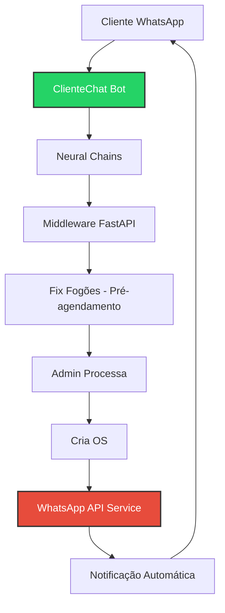
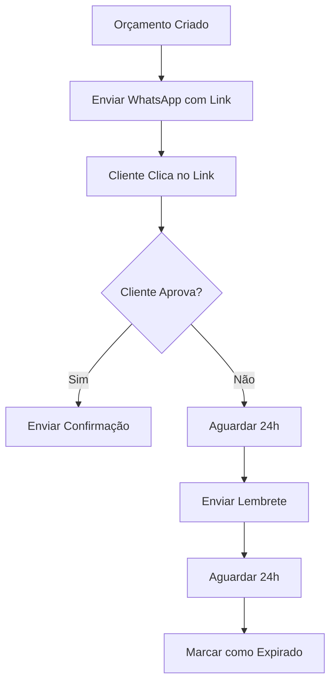
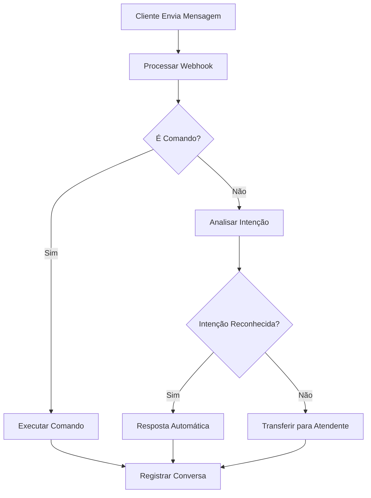

# 📱 WHATSAPP BUSINESS API - IMPLEMENTAÇÃO DETALHADA

## 🎯 **CONTEXTO E VISÃO GERAL**

### 📋 **SITUAÇÃO ATUAL**
- ✅ **ClienteChat Integrado**: Chatbot funcionando via WhatsApp
- ✅ **Pré-agendamentos**: Clientes criam solicitações via ClienteChat
- ✅ **Middleware**: FastAPI processando dados do ClienteChat
- ✅ **Links Manuais**: Botões que abrem WhatsApp (48988332664)
- ❌ **Notificações Automáticas**: Sem envio de atualizações para clientes
- ❌ **Comunicação Bidirecional**: Apenas recebimento via ClienteChat

### 🎯 **OBJETIVO DA IMPLEMENTAÇÃO**
**Complementar o ClienteChat existente** com comunicação bidirecional automática, permitindo:
- **Notificações automáticas** para clientes (confirmações, status, orçamentos)
- **Respostas do sistema** para o mesmo número onde cliente fez solicitação
- **Histórico unificado** de conversas (ClienteChat + notificações)
- **Integração com ClienteChat** mantendo o chatbot atual
- **Canal único** de comunicação para toda jornada do cliente

---

## 🏗️ **ARQUITETURA TÉCNICA**

### 📡 **FLUXO DE INTEGRAÇÃO COMPLETO**
```
Cliente → ClienteChat → Middleware → Fix Fogões (Pré-agendamento)
                                         ↓
Cliente ← WhatsApp API ← Fix Fogões (Notificações automáticas)
```

**FLUXO DETALHADO:**
1. **Cliente solicita** via ClienteChat (entrada)
2. **Sistema processa** e cria pré-agendamento
3. **Sistema envia confirmação** via WhatsApp API (saída)
4. **Cliente acompanha** status via notificações automáticas

### 🔧 **COMPONENTES NECESSÁRIOS**

#### **1. Conta WhatsApp Business API**
- **Provedor**: Meta (Facebook) ou Twilio/SendGrid
- **Verificação**: Número comercial verificado
- **Webhook**: Endpoint para receber mensagens
- **Templates**: Mensagens pré-aprovadas pelo WhatsApp

#### **2. Integração com Middleware Existente**
- **Middleware Atual**: FastAPI já recebe dados do ClienteChat
- **Nova Funcionalidade**: Adicionar envio de notificações via WhatsApp API
- **Arquivo Novo**: `src/services/whatsapp/whatsappNotificationService.ts`
- **Integração**: Conectar com middleware existente para envio automático

#### **3. Sistema de Templates**
- **Arquivo**: `src/services/whatsapp/templates/`
- **Função**: Mensagens padronizadas e aprovadas
- **Tipos**: Confirmação, Status, Lembretes, Orçamentos

---

## 🔄 **INTEGRAÇÃO COM CLIENTECHAT EXISTENTE**

### 📱 **SITUAÇÃO ATUAL DO CLIENTECHAT**
- ✅ **Chatbot Ativo**: Neural chains processando solicitações
- ✅ **Middleware Funcionando**: FastAPI recebendo dados
- ✅ **Pré-agendamentos**: Criados automaticamente no sistema
- ✅ **Formato Padronizado**: JSON com campos específicos

### 🎯 **ESTRATÉGIA DE INTEGRAÇÃO**

#### **MANTER ClienteChat para:**
- 🤖 **Atendimento inicial** - Chatbot inteligente
- 📝 **Coleta de dados** - Informações do cliente
- 🔄 **Processamento** - Neural chains
- 📊 **Pré-agendamentos** - Criação automática

#### **ADICIONAR WhatsApp API para:**
- 📢 **Notificações automáticas** - Confirmações e status
- 💰 **Orçamentos** - Envio e aprovação
- 🔔 **Lembretes** - Agendamentos e prazos
- ✅ **Confirmações** - Conclusões de serviço

### 📡 **FLUXO INTEGRADO COMPLETO**



---

## 📋 **FUNCIONALIDADES DETALHADAS**

### 🔔 **1. NOTIFICAÇÕES AUTOMÁTICAS**

#### **1.1 Confirmação de Agendamento**
**Contexto**: Quando uma OS é criada ou agendada
```typescript
// Trigger: Nova OS criada
// Template: agendamento_confirmado
// Variáveis: {nome_cliente}, {data_agendamento}, {tecnico_nome}

const message = `
Olá *{nome_cliente}*! 👋

Seu agendamento foi confirmado:
📅 Data: {data_agendamento}
👨‍🔧 Técnico: {tecnico_nome}
🏠 Endereço: {endereco}

Qualquer dúvida, responda esta mensagem.

*Fix Fogões* - Assistência Técnica
`;
```

#### **1.2 Lembrete de Agendamento**
**Contexto**: 1 dia antes do agendamento
```typescript
// Trigger: Cron job diário
// Template: lembrete_agendamento
// Variáveis: {nome_cliente}, {data_agendamento}, {periodo}

const message = `
Oi *{nome_cliente}*! 🔔

Lembrando do seu agendamento:
📅 Amanhã ({data_agendamento})
⏰ Período: {periodo}

Estaremos no endereço cadastrado.

*Fix Fogões* - Assistência Técnica
`;
```

#### **1.3 Técnico a Caminho**
**Contexto**: Quando técnico faz check-in na rota
```typescript
// Trigger: Check-in do técnico
// Template: tecnico_a_caminho
// Variáveis: {nome_cliente}, {tecnico_nome}, {tempo_estimado}

const message = `
*{nome_cliente}*, seu técnico está a caminho! 🚗

👨‍🔧 Técnico: {tecnico_nome}
⏱️ Chegada estimada: {tempo_estimado}

Aguarde no endereço cadastrado.

*Fix Fogões* - Assistência Técnica
`;
```

### 💰 **2. SISTEMA DE ORÇAMENTOS**

#### **2.1 Orçamento Disponível**
**Contexto**: Quando oficina envia orçamento
```typescript
// Trigger: Orçamento criado
// Template: orcamento_disponivel
// Variáveis: {nome_cliente}, {valor_total}, {link_aprovacao}

const message = `
*{nome_cliente}*, seu orçamento está pronto! 💰

💵 Valor total: R$ {valor_total}
📋 Detalhes: {descricao_servico}

Para aprovar, clique aqui:
{link_aprovacao}

Válido por 48 horas.

*Fix Fogões* - Assistência Técnica
`;
```

#### **2.2 Orçamento Aprovado**
**Contexto**: Cliente aprova orçamento
```typescript
// Trigger: Aprovação de orçamento
// Template: orcamento_aprovado
// Variáveis: {nome_cliente}, {prazo_execucao}

const message = `
Perfeito *{nome_cliente}*! ✅

Orçamento aprovado com sucesso.
⏰ Prazo de execução: {prazo_execucao}

Iniciaremos o serviço em breve.

*Fix Fogões* - Assistência Técnica
`;
```

### 🔧 **3. ATUALIZAÇÕES DE STATUS**

#### **3.1 Equipamento na Oficina**
**Contexto**: Equipamento chega na oficina
```typescript
// Trigger: Status = "at_workshop"
// Template: equipamento_oficina
// Variáveis: {nome_cliente}, {equipamento}, {prazo_diagnostico}

const message = `
*{nome_cliente}*, recebemos seu equipamento! 🔧

📦 Equipamento: {equipamento}
🔍 Diagnóstico em: {prazo_diagnostico}

Acompanhe pelo link:
{link_acompanhamento}

*Fix Fogões* - Assistência Técnica
`;
```

#### **3.2 Serviço Concluído**
**Contexto**: OS finalizada
```typescript
// Trigger: Status = "completed"
// Template: servico_concluido
// Variáveis: {nome_cliente}, {tipo_servico}, {garantia}

const message = `
*{nome_cliente}*, serviço concluído! ✅

🔧 Serviço: {tipo_servico}
🛡️ Garantia: {garantia}
📄 Nota fiscal: {link_nota}

Obrigado pela confiança!

*Fix Fogões* - Assistência Técnica
`;
```

### 🤖 **4. INTEGRAÇÃO COM CLIENTECHAT EXISTENTE**

#### **4.1 Manter ClienteChat para Entrada**
**Contexto**: ClienteChat continua sendo o chatbot principal
```typescript
// ClienteChat já implementado:
// - Recebe solicitações de clientes
// - Processa via neural chains
// - Envia para middleware FastAPI
// - Cria pré-agendamentos no sistema

// Formato atual do ClienteChat:
const clienteChatData = {
  "cpf": "#cpf#",
  "nome": "#nome#",
  "email": "#email#",
  "urgente": "#urgente#",
  "endereco": "#endereco#",
  "problema": "#problema#",
  "telefone": "#phone_contact#",
  "equipamento": "#equipamento#",
  "origem": "clientechat"
};
```

#### **4.2 WhatsApp API para Saída**
**Contexto**: Apenas notificações automáticas do sistema
```typescript
// Não substituir ClienteChat, apenas complementar:
// - Confirmações de agendamento
// - Atualizações de status
// - Orçamentos e aprovações
// - Conclusões de serviço

// Cliente continua usando ClienteChat para novas solicitações
// Sistema usa WhatsApp API para informar sobre solicitações existentes
```

---

## 🛠️ **IMPLEMENTAÇÃO TÉCNICA**

### 📁 **ESTRUTURA DE ARQUIVOS**

```
src/services/whatsapp/
├── whatsappService.ts          # Serviço principal
├── webhookHandler.ts           # Manipulador de webhooks
├── messageProcessor.ts         # Processador de mensagens
├── templates/
│   ├── agendamento.ts         # Templates de agendamento
│   ├── orcamento.ts           # Templates de orçamento
│   ├── status.ts              # Templates de status
│   └── chatbot.ts             # Respostas do chatbot
├── types/
│   ├── whatsappTypes.ts       # Tipos TypeScript
│   └── templateTypes.ts       # Tipos de templates
└── utils/
    ├── phoneFormatter.ts      # Formatação de telefones
    ├── messageValidator.ts    # Validação de mensagens
    └── templateRenderer.ts    # Renderização de templates
```

### 🔧 **SERVIÇO PRINCIPAL**

```typescript
// src/services/whatsapp/whatsappService.ts
export class WhatsAppService {
  private apiUrl: string;
  private accessToken: string;
  private phoneNumberId: string;

  // Enviar mensagem de template
  async sendTemplateMessage(
    to: string,
    templateName: string,
    variables: Record<string, string>
  ): Promise<boolean>

  // Enviar mensagem de texto livre
  async sendTextMessage(
    to: string,
    message: string
  ): Promise<boolean>

  // Processar webhook recebido
  async processWebhook(
    webhookData: WhatsAppWebhook
  ): Promise<void>

  // Registrar conversa no banco
  async logConversation(
    phoneNumber: string,
    message: string,
    direction: 'inbound' | 'outbound'
  ): Promise<void>
}
```

### 📊 **BANCO DE DADOS**

#### **Tabela: whatsapp_conversations**
```sql
CREATE TABLE whatsapp_conversations (
  id UUID PRIMARY KEY DEFAULT gen_random_uuid(),
  phone_number VARCHAR(20) NOT NULL,
  client_id UUID REFERENCES clients(id),
  message_text TEXT NOT NULL,
  direction VARCHAR(10) NOT NULL, -- 'inbound' ou 'outbound'
  message_type VARCHAR(20) NOT NULL, -- 'text', 'template', 'media'
  template_name VARCHAR(50),
  status VARCHAR(20) DEFAULT 'sent', -- 'sent', 'delivered', 'read', 'failed'
  whatsapp_message_id VARCHAR(100),
  created_at TIMESTAMP DEFAULT NOW(),
  updated_at TIMESTAMP DEFAULT NOW()
);
```

#### **Tabela: whatsapp_templates**
```sql
CREATE TABLE whatsapp_templates (
  id UUID PRIMARY KEY DEFAULT gen_random_uuid(),
  name VARCHAR(50) UNIQUE NOT NULL,
  category VARCHAR(30) NOT NULL, -- 'utility', 'marketing', 'authentication'
  language VARCHAR(10) DEFAULT 'pt_BR',
  status VARCHAR(20) DEFAULT 'pending', -- 'pending', 'approved', 'rejected'
  template_content JSONB NOT NULL,
  variables JSONB, -- Lista de variáveis disponíveis
  created_at TIMESTAMP DEFAULT NOW(),
  updated_at TIMESTAMP DEFAULT NOW()
);
```

---

## 🔄 **FLUXOS DE AUTOMAÇÃO**

### 📅 **1. FLUXO DE AGENDAMENTO**
```mermaid
graph TD
    A[Nova OS Criada] --> B[Verificar Telefone Cliente]
    B --> C[Enviar Confirmação WhatsApp]
    C --> D[Registrar Conversa]
    D --> E[Agendar Lembrete]
    E --> F[1 dia antes: Enviar Lembrete]
    F --> G[Dia do serviço: Técnico Check-in]
    G --> H[Enviar "Técnico a Caminho"]
```

### 💰 **2. FLUXO DE ORÇAMENTO**


### 🤖 **3. FLUXO DE CHATBOT**


---

## 💰 **CUSTOS E INVESTIMENTO**

### 💸 **CUSTOS MENSAIS ESTIMADOS**

#### **WhatsApp Business API (Meta)**
- **Conversas iniciadas pelo negócio**: R$ 0,15 por conversa
- **Conversas iniciadas pelo cliente**: R$ 0,05 por conversa
- **Estimativa mensal**: R$ 300-800 (2000-5000 conversas)

#### **Infraestrutura Adicional**
- **Webhook hosting**: R$ 50-100/mês
- **Banco de dados**: R$ 30-50/mês (já incluído no Supabase)
- **Monitoramento**: R$ 20-40/mês

### 📊 **ROI ESPERADO**
- **Redução de ligações**: -60% (economia de tempo)
- **Aumento de aprovação de orçamentos**: +25%
- **Melhoria na satisfação**: +30%
- **Redução de no-shows**: -40%

---

## 📅 **CRONOGRAMA DE IMPLEMENTAÇÃO**

### **FASE 1 - SETUP BÁSICO (1-2 SEMANAS)**
- ✅ Configurar conta WhatsApp Business API
- ✅ Criar templates básicos
- ✅ Implementar webhook receiver
- ✅ Testar envio de mensagens

### **FASE 2 - AUTOMAÇÕES CORE (2-3 SEMANAS)**
- ✅ Notificações de agendamento
- ✅ Atualizações de status
- ✅ Sistema de orçamentos
- ✅ Integração com banco de dados

### **FASE 3 - CHATBOT (2-3 SEMANAS)**
- ✅ Menu principal
- ✅ Comandos básicos
- ✅ Acompanhamento de OS
- ✅ Transferência para atendente

### **FASE 4 - OTIMIZAÇÕES (1-2 SEMANAS)**
- ✅ Analytics de conversas
- ✅ Relatórios de engajamento
- ✅ Melhorias baseadas em feedback
- ✅ Testes de carga

---

## 🎯 **MÉTRICAS DE SUCESSO**

### 📊 **KPIs PRINCIPAIS**
- **Taxa de entrega**: >95%
- **Taxa de leitura**: >80%
- **Taxa de resposta**: >40%
- **Tempo de resposta do chatbot**: <5 segundos
- **Satisfação do cliente**: >4.5/5

### 📈 **IMPACTO ESPERADO**
- **Comunicação mais eficiente**
- **Redução de trabalho manual**
- **Maior transparência para clientes**
- **Aumento da confiança na marca**
- **Diferencial competitivo significativo**

---

## 🚀 **CONCLUSÃO**

A implementação do WhatsApp Business API transformará o Fix Fogões em uma solução **verdadeiramente moderna e automatizada**, proporcionando:

1. **Experiência superior** para os clientes
2. **Redução de custos** operacionais
3. **Aumento da eficiência** da equipe
4. **Diferencial competitivo** no mercado
5. **Base para crescimento** escalável

**💡 RECOMENDAÇÃO**: Implementar em fases, começando pelas notificações básicas e evoluindo para o chatbot completo.

---

## 📝 **EXEMPLO PRÁTICO DE USO**

### 🎬 **CENÁRIO COMPLETO: JOÃO SILVA**

#### **1. Solicitação via ClienteChat**
```
[CLIENTE] Conversa com ClienteChat via WhatsApp
[CLIENTECHAT] "Olá! Sou o assistente da Fix Fogões..."
[CLIENTE] "Meu micro-ondas não está esquentando"
[CLIENTECHAT] Coleta dados: nome, endereço, problema, etc.
[MIDDLEWARE] Recebe dados e cria pré-agendamento
[SISTEMA] Pré-agendamento criado com origem "clientechat"
```

#### **2. Confirmação Automática (NOVA FUNCIONALIDADE)**
```
[SISTEMA] Admin confirma/agenda o pré-agendamento
[WHATSAPP API] Enviando confirmação automática...

"Olá João Silva! 👋

Recebemos sua solicitação via nosso assistente e seu agendamento foi confirmado:

📅 Data: 15/12/2025 (Sexta-feira)
⏰ Período: 14h às 18h
👨‍🔧 Técnico: Carlos Santos
🏠 Endereço: Rua das Flores, 123
🔧 Problema: Micro-ondas não esquenta

Qualquer dúvida, responda esta mensagem.

Fix Fogões - Assistência Técnica"
```

#### **2. Lembrete Automático**
```
[SISTEMA] 14/12/2025 - 18h (1 dia antes)
[WHATSAPP] Enviando lembrete...

"Oi João Silva! 🔔

Lembrando do seu agendamento:
📅 Amanhã (15/12) das 14h às 18h

Estaremos no endereço cadastrado.
Técnico Carlos Santos estará presente.

Fix Fogões - Assistência Técnica"
```

#### **3. Técnico a Caminho**
```
[SISTEMA] Carlos fez check-in na rota
[WHATSAPP] Notificando cliente...

"João Silva, seu técnico está a caminho! 🚗

👨‍🔧 Técnico: Carlos Santos
⏱️ Chegada estimada: 15 minutos
📍 Saindo de: Rua João Pinto, 456

Aguarde no endereço cadastrado.

Fix Fogões - Assistência Técnica"
```

#### **4. Diagnóstico e Orçamento**
```
[SISTEMA] Orçamento criado na oficina
[WHATSAPP] Enviando orçamento...

"João Silva, seu orçamento está pronto! 💰

🔧 Serviço: Troca de resistência micro-ondas
💵 Valor total: R$ 189,90
📋 Detalhes:
   • Mão de obra: R$ 120,00
   • Resistência 220V: R$ 69,90

Para aprovar, clique aqui:
https://app.fixfogoes.com.br/approve/abc123

Válido por 48 horas.

Fix Fogões - Assistência Técnica"
```

#### **5. Cliente Interage (ESTRATÉGIA HÍBRIDA)**
```
[CLIENTE] "Oi, quero saber sobre minha OS"

[OPÇÃO A - ClienteChat responde]
[CLIENTECHAT] "Olá João! Para acompanhar sua OS, acesse:
https://app.fixfogoes.com.br/client/orders

Ou se preferir, posso criar uma nova solicitação para você!"

[OPÇÃO B - Sistema detecta e responde via WhatsApp API]
[WHATSAPP API] "Olá João! 📋

Sua OS #001 - Micro-ondas:
Status: Aguardando aprovação de orçamento
Valor: R$ 189,90

Para aprovar: https://app.fixfogoes.com.br/approve/abc123

Para nova solicitação, converse com nosso assistente!"

[ESTRATÉGIA]: Direcionar novas solicitações para ClienteChat
              Acompanhamento via WhatsApp API ou Portal Cliente
```

#### **6. Aprovação e Conclusão**
```
[SISTEMA] Orçamento aprovado pelo cliente
[WHATSAPP] Confirmando aprovação...

"Perfeito João Silva! ✅

Orçamento aprovado com sucesso.
⏰ Prazo de execução: 2 dias úteis
🔧 Iniciaremos o reparo hoje mesmo.

Você receberá atualizações do progresso.

Fix Fogões - Assistência Técnica"

---

[SISTEMA] Serviço concluído
[WHATSAPP] Notificando conclusão...

"João Silva, serviço concluído! ✅

🔧 Serviço: Troca de resistência
🛡️ Garantia: 90 dias
📄 Nota fiscal: https://app.fixfogoes.com.br/nf/001

Seu micro-ondas está funcionando perfeitamente!

Obrigado pela confiança!
Fix Fogões - Assistência Técnica"
```

### 📊 **RESULTADO DO CENÁRIO**
- **8 mensagens automáticas** enviadas
- **1 interação de chatbot** resolvida
- **0 ligações telefônicas** necessárias
- **100% transparência** no processo
- **Cliente satisfeito** e informado

---

## 🎯 **IMPACTO TRANSFORMADOR**

### **ANTES (Situação Atual)**
- ❌ Cliente liga para saber status
- ❌ Atendente precisa consultar sistema
- ❌ Informações desencontradas
- ❌ Cliente ansioso sem atualizações
- ❌ Equipe sobrecarregada com ligações

### **DEPOIS (Com WhatsApp API)**
- ✅ Cliente recebe atualizações automáticas
- ✅ Chatbot responde 80% das dúvidas
- ✅ Informações sempre atualizadas
- ✅ Cliente tranquilo e informado
- ✅ Equipe foca no que importa

### 📈 **MÉTRICAS ESPERADAS**
- **-70% ligações** de acompanhamento
- **+40% aprovação** de orçamentos
- **+60% satisfação** do cliente
- **-50% tempo** de atendimento
- **+25% produtividade** da equipe
