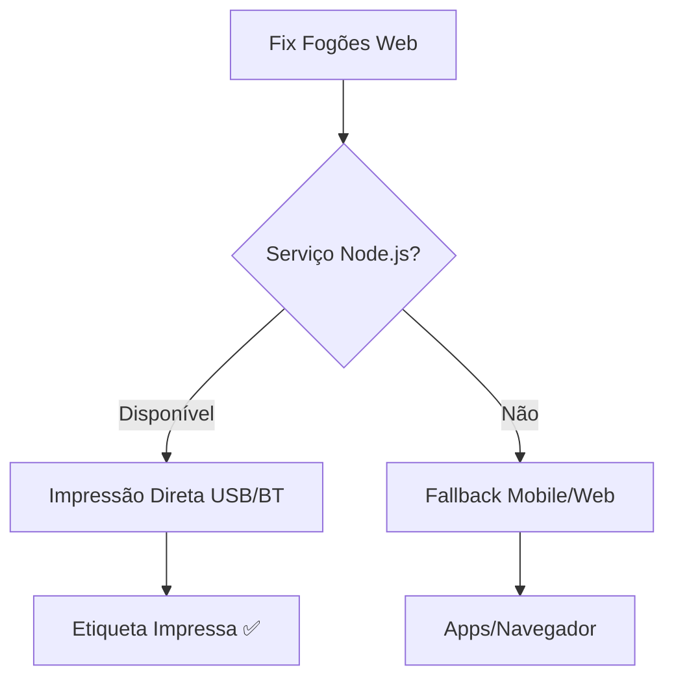

# 🖨️ Fix Fogões - Serviço de Impressão Térmica

Serviço Node.js para impressão em impressoras térmicas universais via USB/Bluetooth.

## 🎯 **Vantagens desta Solução**

- ✅ **Funciona com qualquer impressora térmica** (58mm, 80mm)
- ✅ **Suporte nativo USB e Bluetooth**
- ✅ **Não depende de apps de terceiros**
- ✅ **Controle total sobre comandos ESC/POS**
- ✅ **Funciona em Windows, Mac e Linux**
- ✅ **Integração automática com Fix Fogões**

## 🚀 **Instalação Rápida**

### **Windows:**
1. Baixe e instale [Node.js](https://nodejs.org/)
2. Execute `install.bat`
3. Pronto! O serviço estará rodando

### **Manual:**
```bash
# Instalar dependências
npm install

# Iniciar serviço
npm start

# Instalar como serviço do Windows (opcional)
npm run install-service
```

## 🔧 **Como Usar**

### **🔌 Impressora USB (Mais Fácil):**
1. **Conecte sua impressora térmica** via USB
2. **Execute o serviço** (install.bat ou npm start)
3. **Abra o Fix Fogões** no navegador
4. **Clique "Imprimir"** - funciona automaticamente!

### **🔵 Impressora Bluetooth:**
1. **Pareie a impressora** no Bluetooth do Windows
2. **Execute o serviço** (install.bat ou npm start)
3. **Acesse:** http://localhost:3001/bluetooth-config.html
4. **Configure e teste** a conexão Bluetooth
5. **Use normalmente** no Fix Fogões

## 📡 **API Endpoints**

- `GET /api/status` - Status do serviço
- `GET /api/printers` - Lista impressoras disponíveis  
- `POST /api/print` - Imprime etiqueta térmica

## 🖨️ **Impressoras Testadas**

- ✅ Impressoras térmicas 58mm genéricas
- ✅ Impressoras térmicas 80mm genéricas
- ✅ Modelos com protocolo ESC/POS
- ✅ Conexão USB e Bluetooth

## 🔍 **Solução de Problemas**

### **Impressora não encontrada:**
- Verifique se está conectada via USB
- Para Bluetooth: pareie primeiro no Windows
- Teste com outro software de impressão

### **Erro de permissão:**
- Execute como administrador
- Verifique drivers da impressora

### **Serviço não inicia:**
- Verifique se porta 3001 está livre
- Instale Node.js mais recente

## 🎯 **Fluxo de Impressão**



## 📱 **Integração com Fix Fogões**

O Fix Fogões detecta automaticamente se o serviço está rodando:

1. **Prioridade 1**: Serviço Node.js (melhor qualidade)
2. **Prioridade 2**: Apps mobile (iOS/Android)  
3. **Prioridade 3**: Impressão web padrão

## 🔧 **Configuração Avançada**

### **Bluetooth Manual:**
Se sua impressora Bluetooth não for detectada automaticamente:

1. Pareie no Windows primeiro
2. Encontre o endereço MAC
3. Configure manualmente no código

### **Impressoras Específicas:**
Para impressoras com comandos especiais, edite `server.js`:

```javascript
// Adicionar configurações específicas
const CUSTOM_PRINTER = {
  width: 32,
  initCommands: '\x1B\x40\x1B\x74\x13', // Comandos específicos
  // ...
};
```

## 📞 **Suporte**

- 🐛 **Problemas**: Verifique logs no terminal
- 📧 **Contato**: Equipe Fix Fogões
- 🔧 **Customização**: Código aberto, pode modificar

---

**🎉 Agora você tem impressão térmica profissional integrada ao Fix Fogões!**
